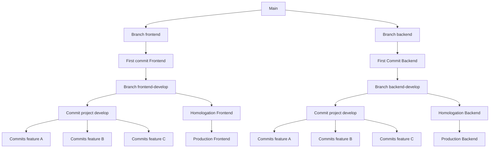
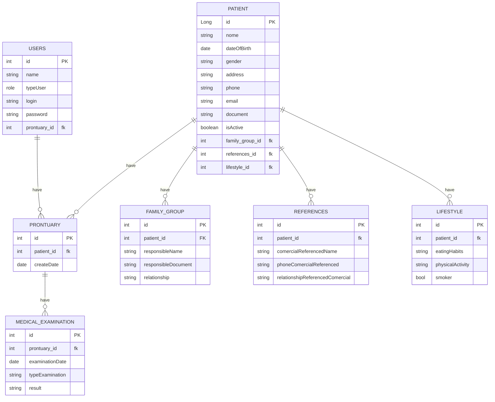

# ProjetoPessoal-Curso-DIO-HealthStatus
Projeto para construir uma api e entregar no bootcamp da DEAL pela DIO, porém vou ser ousado!!!
#### Aplicação onde é realizado registro de informações básicas sobre a saúde do:
- Paciente
- Aluno de academia
- Aluno de natação
- etc...

# Fluxo de Branchs e Commits

<body>
    
A branch main irá conter as seguintes branches:

    <ul>
        <li>frontend</li>
        <li>backend</li>
    </ul>
    
Dentro das branches, haverá o first commit das suas respectivas tecnologias.

    
Para o desenvolvimento da aplicação, serão criadas duas branches a partir da branch existente frontend e backend com os nomes:

    <ul>
        <li>frontend-develop</li>
        <li>backend-develop</li>
    </ul>
    
A partir das branches criadas da sua respectiva tecnologia, serão criadas as features necessárias para o desenvolvimento do projeto. No final da feature, quando pronta, será realizado um pull request para a branch principal da sua respectiva tecnologia (backend ou frontend).

    
Quando a tecnologia estiver pronta para testes, será feito um pull request para a branch de homologation, e, em seguida, quando estiver pronto e sem bugs, para a branch de produção.

</body>

--------------------------------------

# Abaixo está o diagrama do projeto que será utilizado para a construção da api e modelagem do banco de dados.

# Em seguida está o fluxo do usuário do sistema para a construção e planejamento no Figma(EM CONSTRUÇÃO).

